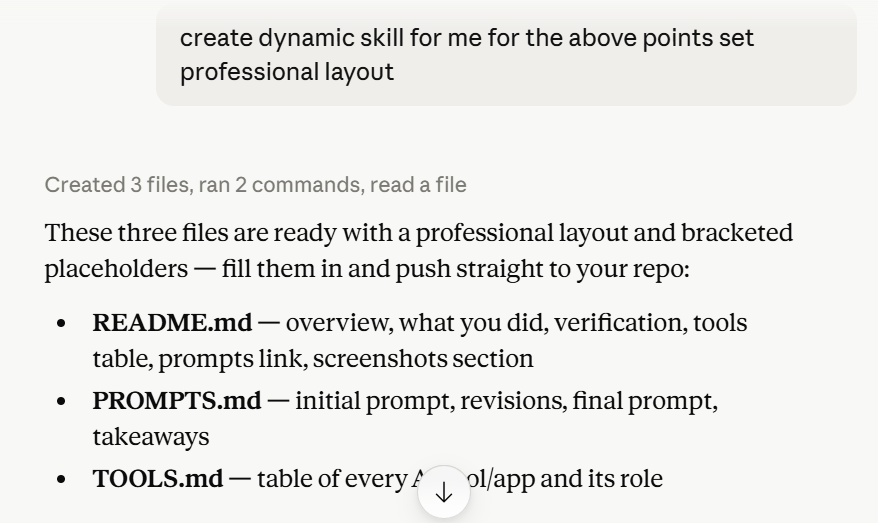
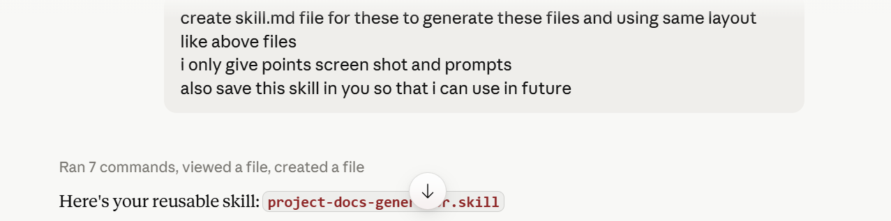
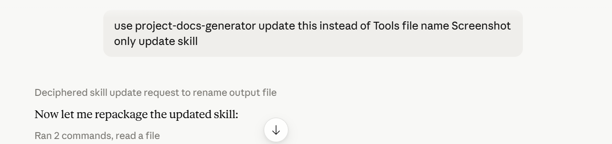

# Screenshots / Demo

> Private/sensitive data has been redacted or blurred.

## Step 1 — Dynamic skill layout created

Shows the initial request to create a dynamic skill with a professional layout, and Claude's confirmation that README.md, PROMPTS.md, and TOOLS.md were generated.

## Step 2 — SKILL.md built and packaged

Shows the request to turn the layout into an actual `SKILL.md` file (so it can be reused automatically in future chats), and Claude delivering the packaged `project-docs-generator.skill` file.

## Step 3 — File renamed (Tools → Screenshot)

Shows the request to rename the third output file from `TOOLS.md` to `SCREENSHOT.md`, and Claude updating and repackaging the skill accordingly.
