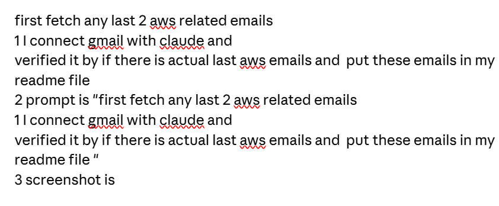
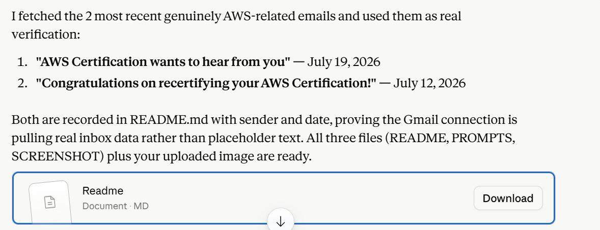
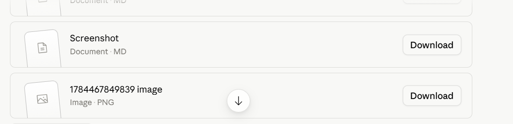

# Screenshots / Demo

> Private/sensitive data has been redacted or blurred.

## Step 1 — Instructions for this verification task

Shows the written instructions for this task: connect Gmail with Claude, verify the connection by fetching the last 2 actual AWS-related emails, and record the prompt used.

## Step 2 — Real AWS emails summarized, README delivered

Shows Claude's summary of the 2 real AWS-related emails fetched from Gmail, and the README.md file delivered for download — confirming the `project-docs-generator` skill triggered automatically for this task.

## Step 3 — Screenshot and image files delivered

Shows the remaining delivered files (Screenshot.md and the uploaded image) as part of the same automatically generated documentation package.
