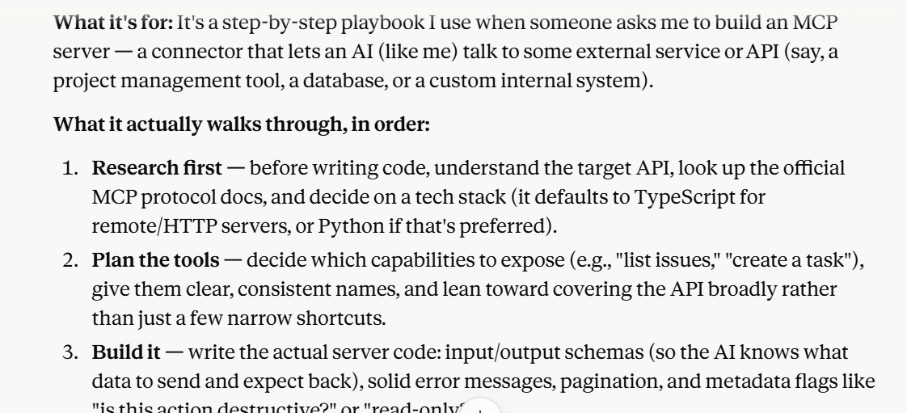
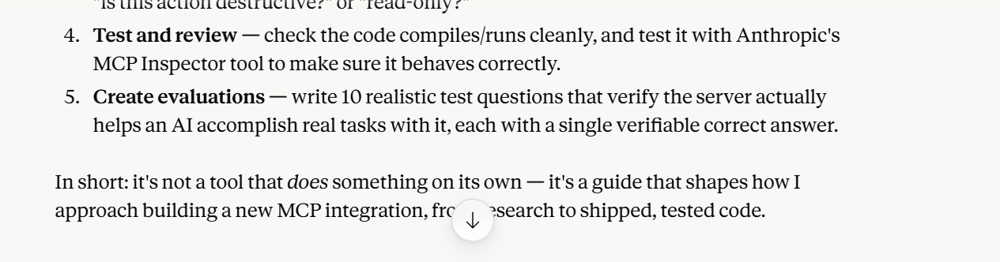
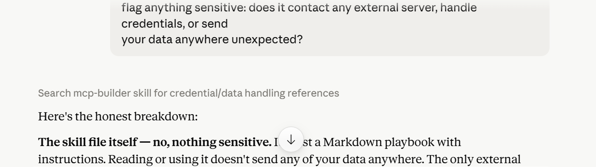

# Screenshots / Demo

> Private/sensitive data has been redacted or blurred.

## Step 1 — Plain-English explanation (part 1)

Shows the start of Claude's plain-English explanation of the mcp-builder skill: what it's for, and the first steps of the 5-step playbook (research first, plan the tools, build it).

## Step 2 — Plain-English explanation (part 2)

Shows the remaining steps (test and review, create evaluations) and the closing summary that the skill is a guide, not something that acts on its own.

## Step 3 — Sensitivity/safety review

Shows the request to flag anything sensitive about the skill, and Claude searching the skill's files for credential/data-handling references before answering.
